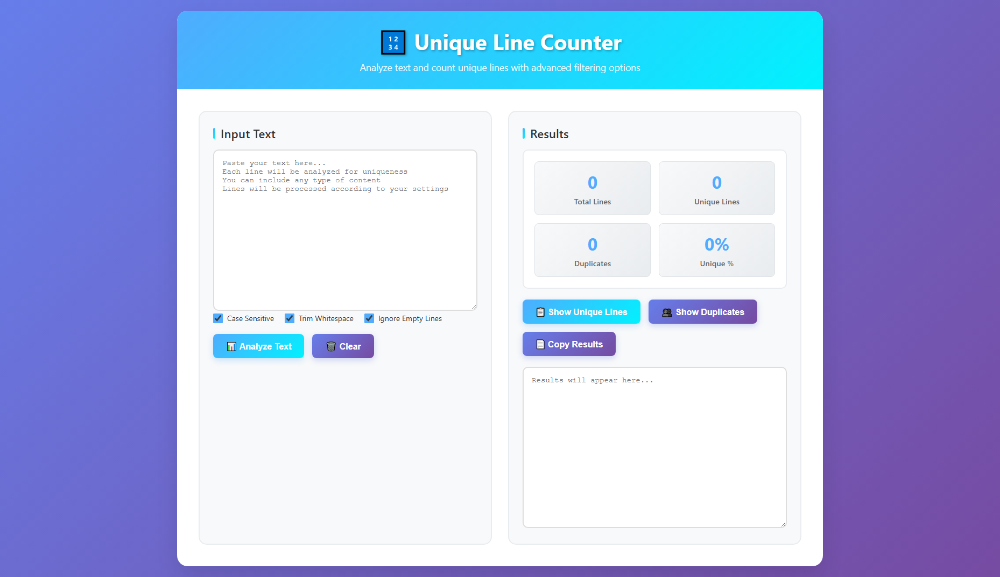

# 🔢 Unique Line Counter

A beautifully designed web app that helps you analyze and count **unique** and **duplicate** lines in any text with advanced filtering options.

 <!-- You can replace this with an actual screenshot -->

---

## ✨ Features

- ✅ Real-time line analysis with **debounce**
- 🔠 **Case-sensitive** or insensitive matching
- 🧹 Option to **trim whitespace**
- 🚫 Option to **ignore empty lines**
- 📊 Stats:
  - Total lines
  - Unique lines
  - Duplicate lines
  - Percentage of uniqueness
- 📋 Display & copy:
  - Unique lines (sorted)
  - Duplicates with count
- 💻 Responsive UI for mobile and desktop

---

## 🚀 Live Demo

Check it out here: [https://your-username.github.io/unique-line-counter](https://your-username.github.io/unique-line-counter)  
*(Replace with actual link if hosted on GitHub Pages or other platform)*

---

## 🛠️ How to Use

1. **Paste or type text** into the input textarea.
2. Enable/disable options as needed:
   - **Case Sensitive**
   - **Trim Whitespace**
   - **Ignore Empty Lines**
3. Results will auto-update, or click `📊 Analyze Text`.
4. Use buttons to:
   - `📋 Show Unique Lines`
   - `👥 Show Duplicates`
   - `📄 Copy Results`
   - `🗑️ Clear` input

---

## 📂 Project Structure

```

📁 unique-line-counter/
├── index.html         # Main HTML file with embedded CSS & JS
├── README.md          # Project documentation
└── preview\.png        # Optional preview screenshot

````

---

## 📦 Setup Locally

```bash
git clone https://github.com/your-username/unique-line-counter.git
cd unique-line-counter
open index.html  # or just drag into browser
````

> No build tools or frameworks needed — it's 100% vanilla HTML, CSS, and JS.

---

## 🧪 Example Input

```
apple
banana
Apple
banana
orange
```

With:

* ❌ Case Sensitive
* ✅ Trim Whitespace
* ✅ Ignore Empty Lines

You’ll see:

* ✅ 5 Total Lines
* 🎯 3 Unique
* 🔁 2 Duplicates

---

## 🤝 Contributing

Pull requests and suggestions are welcome!
Feel free to fork the repo and submit changes.

---

## 📄 License

This project is licensed under the [MIT License](LICENSE).

---

## 👨‍💻 Author

**Abdelhadi Haddadi**
[GitHub Profile](https://github.com/abdelhadi-haddadi)

---
